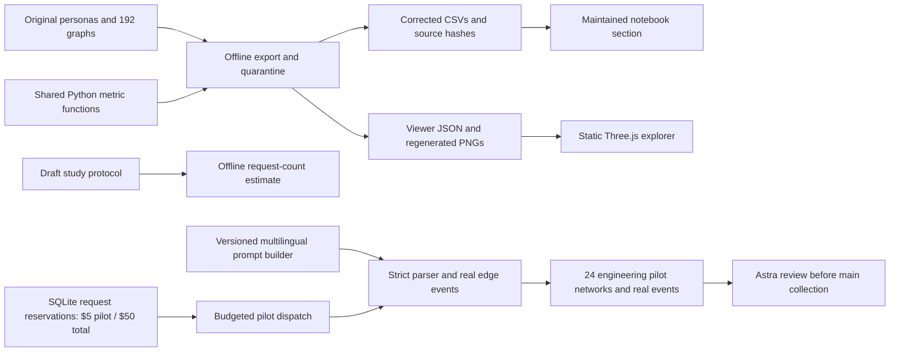

# Repository Architecture

## Current Revised Calibration

October 2: `calibration_v6.py` completed 104 separately authorized graphs under
contract `5fb3715550db`, using the unchanged shared graph engine and paid ledger.
`revision_next.py` supplies revised prompts and independent actor/quota/display
schedules. `calibration_v6_io.py` adds only audited local journal-write retries;
it does not alter prompts, API retry policy or prices.

`inspect_calibration_v6.py` replays received decisions, verifies artifacts and
produces key-free compliance/cost reports under `outputs/calibration_v6/5fb3715550db/`.
The maintained notebook validates that report's receipt/CSV hashes before display.
Simulation exports remain unchanged. Read [the new results](docs/CALIBRATION_V6_RESULTS.md):
$7.8549, 104 verified graphs, 142 tests, and a main-study hold because 22/26
global graphs are empty and scientific allocation decisions remain pending.

## Historical V5 896-Target Pipeline

**Historical inspection:** all 68 v5 calibration graphs verified, 204 offline controls
generated and 88 tests passing. Additional calibration accounting is $4.454524450,
within the original $5 allowance. The reviewed replacement preserved the failed
request's reservation, all 194 cached replies and the six original receipts.
Generation is stopped; the 896-run main batch is not authorized.
See [CALIBRATION_RESULTS.md](CALIBRATION_RESULTS.md) for actual spend, updated
cost/runtime estimates and the distinction between software checks and research acceptance.

The replacement pipeline is documented in [RESEARCH_896_HANDOFF.md](RESEARCH_896_HANDOFF.md).
`revision224_prompts.py` constructs the declared fictional adult roster and
independent country/instruction-language treatments. `revision224.py` prepares
the 896-cell manifest and 80 prompt examples, runs labelled offline fixtures,
and checks exact source/protocol/roster review hashes before paid execution.
Shared parsing, metrics and matched baselines remain the analysis authority.
The original durable ledger retains prior costs; transport uncertainty stops
without automatic resending. Missing ledgers fail closed. Earlier experiments
and the private team viewer remain historical evidence. The first paid calibration
was stopped for an incomplete global correction, documented in
[CALIBRATION_FINDINGS.md](CALIBRATION_FINDINGS.md). Four original graphs remain
preserved and excluded from the current `revision896_retry_v5` namespace.
Later versions exposed example contamination, empty responses and an undersized
per-person output cap; each repair is versioned and tested. Global corrections preserve the original
unambiguous valid tie set before graph mutation. Unresolved ledger attempts
block new execution across protocol versions, and reports expose both current-
protocol and shared-ledger unresolved counts. Explicit abandonment retains its
full reserved charge and prohibits replay; it is not proof of provider billing.

An explicitly authorized replacement has its own deterministic request ID and
charge; it never changes the abandoned original. Authorization is single-use.
Logging/recovery compatibility binds archived generation hashes to exact current
execution hashes. Request-body parity is tested, both provenances are checked,
and no changed prompt or engine module can use that wrapper-only exception.

An OS-backed workflow lock prevents concurrent fresh writers. Completed receipts
must match artifact hashes, graph metrics, request identities and original ledger
charges before any further API client is created. Preflight also rejects source
changes during checking. `revision224.py --analyze` produces fresh-only per-run
metrics, group homophily, matched controls and paired contrasts under
`stats/revision896_retry_v5/`; its report distinguishes absent, partial and complete data.
`inspect_calibration.py` holds the workflow lock while auditing receipts, graph
metrics, controls and charges. It sums request intervals for an API-only runtime
forecast, excludes pauses between requests, and checks PNG file integrity.
Visual review and scientific validity remain separate from those automated checks.
The PDF concerns and remaining evidence gates are mapped in
[REVIEW_RESPONSE_MATRIX.md](REVIEW_RESPONSE_MATRIX.md).

The seven-setting design estimates country-framing and instruction-language
contrasts on one fictional roster. Eight repetitions are not a power guarantee.
The 68-cell calibration has a separately authorized $5 additional ceiling;
the main batch requires its own finite ceiling and review. Translation and cost
review remain necessary before main collection. This design
does not complete the rejection plan's broader ablation or model-family scope.

## Revision Architecture Report

**Current status: offline repairs and exploration implemented; scientific
revision and main study incomplete; 28 engineering pilots completed.** Older report sections below are archival
context and are superseded where they conflict with this section or
[REVISION_STATUS.md](REVISION_STATUS.md).

### Problem and Method

The budgeted execution path is `paid_study.py`. Its ledger reserves a conservative
upper charge before sending each request, settles recorded provider usage, and
retains unresolved charges. Resumed requests use saved responses, and finished
graphs/PNGs are checked against saved hashes. The legacy API path stays locked.
GPT-6 Luna and the four-run GPT-6 Sol extension use reasoning disabled;
GPT-4.1 Mini uses temperature 0.8. Their
different capabilities/settings are part of the treatment and must be reported.
The pilot retains the historical roster for engineering verification only.
The proposed 640-network main study remains gated on an Astra design review,
five validated adult rosters, prompt review and pilot-informed sample size.

The project audits how pretrained LLMs produce synthetic friendship networks.
It does not train a model and it does not establish a true network for the
fictional people. A connection is one undirected union edge, regardless of which
persona selected it. All primary historical comparisons use one 50-person US
roster, three GPT-4.1 variants, four generation methods and two intended seeds.
Country settings are US, India, Japan and Brazil. Historical languages are
English, Spanish, Hindi and Japanese. Portuguese has four completed Luna
engineering checks; bilingual validation and confirmatory collection are pending.

The static viewer separates the analysis selection from the two network panes.
`research-plots.js` filters saved runs, keeps study/roster/prompt variants separate,
and prepares topology SVGs and demographic-mixing SVGs from exported Python
values. No JavaScript metric engine or browser API credential is added. Checkbox
intersections support multiple values on five dimensions; dataset selection
keeps historical evidence separate from pilots. The URL stores that selection
and metric. CSV/JSON exports retain run identity and source hashes; SVG figures
include condition labels, counts and descriptive-evidence notes. Network A/B
remain independently selectable, including through the selected-run inventory.

### Modules and Contracts

- `generate_networks.py` builds prompts, checks replies before graph mutation,
  and records successful edge changes. New filenames contain `revision-v1`.
  Local uses all other personas; iterative initializes with local selections.
  Those details differ from parts of the supplied review document and must be
  reconciled with the submitted implementation before claiming a replication.
- `constants_and_utils.py` contains provider calls and a three-attempt retry
  policy. SDK retries are disabled. The current shared paid-dispatch release
  gate stops before constructing a client for archived workflows. `paid_study.py`
  owns the separate authorized $5/$50 reservation ledger, usage accounting,
  failed-response audit and artifact-checked resume. `--verify` never opens an
  API client and writes run/usage verification tables.
- `analyze_networks.py` owns corrected edge disagreement, scalar topology,
  group-level and population-weighted Coleman scores, and numeric age
  assortativity. Raw LCC path statistics have explicit `_lcc` names. Legacy
  log-normalized fields remain legacy fields, not silently redefined exports.
- `export_research_viewer.py` enumerates the exact historical matrix, checks IDs,
  self-links and nonempty graphs, recomputes measurements, records source hashes,
  and writes only the revision output directories. Invalid graphs are excluded,
  not sanitized. PNG readability is independent of graph validity.
- `viewer/` is a static client with one pinned rendering dependency. It loads
  local JSON, never an API key. Both views reuse one union-force layout. It handles
  display operations and manual simulation, not research statistical formulas.
  The accessible table remains usable when WebGL is unavailable.
- `analyze_networks.ipynb` retains old analysis behind `RUN_LEGACY_ANALYSIS=False`.
  Its maintained section verifies graph hashes before loading corrected results
  and separately reads real pilot artifacts/usage without dispatching model calls.
- `study_protocol.json` and `plan_revision_study.py` describe proposed scope and
  request ceilings. They do not authorize generation, verify model availability,
  supply a dollar quote or justify statistical power.

### Results and Their Meaning

The authorized engineering pilot completed **24/24 full-50 networks** with
**$1.886188** conservative recorded cost and zero unresolved requests. It tests
all four methods, Luna/Mini/Sol in English, and Luna in Hindi, Japanese and
Portuguese under US framing. Sixteen parser failures are annotated; 454 early
replies lack those annotations. Global-edge and response-count corrections made
during the pilot remain labeled source variants. These graphs support workflow
verification; confirmatory RQ conclusions still need the Astra/protocol gate.

The inventory is **24 cultural + 72 method + 96 language = 192 graphs**. Strict
checks retain **176** and quarantine **16** containing **23 self-links**. All
original graph and roster hashes are preserved. The old "192 verified" claim
therefore cannot be interpreted as simple-graph correctness. Available sample
sizes become unbalanced, and old failure/refusal rates remain unknowable without
attempt logs.

RQ1 has historical framing differences, not demonstrated country-population
effects: sequential mini mean LCC shares are US .50, India .98, Japan .76 and
Brazil .52. RQ2 shows substantial political grouping in those model outputs, but
does not establish a causal demographic ranking. RQ3 shows different edges across
the three OpenAI variants under matched conditions, not cross-family validity.
RQ4 remains confounded historically because participants' spoken language changed
with instructions. Exact examples and files are in the README and revision report.

The roster also includes nine minors, four younger than five, despite assigned
political labels. An adult/source-grounded redesign is needed before political
or cross-cultural findings can be treated as defensible evidence. Changing a
country label alone is not population grounding.

### Validation and Release Boundary

Hand-checkable regression fixtures cover metrics, parsing, bounded failures and
the shared dispatch lock. Mocked integration uses all 50 personas for every
method/language combination without model spend. Export parity checks compare
saved and displayed edges and Python metrics. Notebook execution, desktop/mobile
browser checks and independent read-only review are recorded in
`stats/revision_v1/validation_report.md`.

The reviewer found both safety and provenance gaps. Those budget controls now
exist in the new pilot runner; the old dispatch stays locked. Failed Mini global
replies revealed reversed duplicate edges, leading to an explicit canonical-pair
prompt and localized correction. All costs remain recorded. Pilot prompt variants
are not treated as frozen-protocol replications. The viewer cannot repair missing historical chronology
or scientific controls. Publication remains separate from a passing software
test suite; benchmark reconstruction, bilingual review, robust baselines,
independent rosters and approved confirmatory experiments remain pending.

## Archived Architecture Narrative

This document explains the project as a beginner-friendly pipeline.

## Core Idea

The repo simulates a social network using LLMs.

It does that in four stages:

1. define the people in the network
2. ask a model who should become friends with whom
3. save the resulting graph and visual outputs
4. measure homophily and graph structure

## Main Files And Responsibilities

[generate_personas.py](C:\Users\Hemu\OneDrive\Desktop\D.s\UA_Captsone_SocN\generate_personas.py)
Creates or enriches personas. This is the "who exists?" layer.

[generate_networks.py](C:\Users\Hemu\OneDrive\Desktop\D.s\UA_Captsone_SocN\generate_networks.py)
Main generation engine. This is the "who becomes friends?" layer.

[constants_and_utils.py](C:\Users\Hemu\OneDrive\Desktop\D.s\UA_Captsone_SocN\constants_and_utils.py)
Shared infrastructure. It handles paths, API calls, retries, saving graphs, and drawing PNGs.

[analyze_networks.py](C:\Users\Hemu\OneDrive\Desktop\D.s\UA_Captsone_SocN\analyze_networks.py)
Main metrics layer. This is the "what kind of network came out?" layer.

[plotting.py](C:\Users\Hemu\OneDrive\Desktop\D.s\UA_Captsone_SocN\plotting.py)
Visualization helpers for graphs and analysis tables.

[run_cultural_study.py](C:\Users\Hemu\OneDrive\Desktop\D.s\UA_Captsone_SocN\run_cultural_study.py)
Step 2 experiment orchestrator. It runs the full culture/model/seed matrix and writes aggregate outputs.

[study_runner_utils.py](C:\Users\Hemu\OneDrive\Desktop\D.s\UA_Captsone_SocN\study_runner_utils.py)
Shared experiment helper layer. This keeps the Step 2, Step 3, and Step 4 runners on the same generation, aggregation, and verification path.

[run_method_study.py](C:\Users\Hemu\OneDrive\Desktop\D.s\UA_Captsone_SocN\run_method_study.py)
Step 3 experiment orchestrator. It compares `global`, `local`, and `iterative` under the same culture/model/seed setup used for Step 2.

[run_language_study.py](C:\Users\Hemu\OneDrive\Desktop\D.s\UA_Captsone_SocN\run_language_study.py)
Step 4 experiment orchestrator. It keeps culture fixed and varies the prompt language across English, Spanish, Hindi, and Japanese.

[analyze_networks.ipynb](C:\Users\Hemu\OneDrive\Desktop\D.s\UA_Captsone_SocN\analyze_networks.ipynb)
Exploratory notebook. This is where results are compared, plotted, and interpreted interactively.

[network_datasets.py](C:\Users\Hemu\OneDrive\Desktop\D.s\UA_Captsone_SocN\network_datasets.py)
Loads or converts real/reference datasets for comparison.

[bias.py](C:\Users\Hemu\OneDrive\Desktop\D.s\UA_Captsone_SocN\bias.py)
Bias-oriented text analysis helpers.

## Data Flow

The normal flow is:

1. Personas live in `text-files/*.json`
2. Generation creates graph files in `text-files/*.adj`
3. Graph images are written to `plots/*.png`
4. Analysis writes per-condition CSVs into `stats/<condition>/`
5. The Step 2 runner writes study-level summary files into `stats/cultural_study/`
6. The Step 3 runner writes study-level summary files into `stats/method_study/`
7. The Step 4 runner writes study-level summary files into `stats/language_study/`

## Step 1 Changes

Step 1 was about compatibility and getting the repo runnable with your setup.

Changes made:
- OpenAI-only authentication now works with `OPENAI_API_KEY`
- a Llama key is only required if a non-OpenAI model is actually requested
- default model path was updated to `gpt-4.1-mini`
- saving plots/graphs now creates directories automatically
- a plotting bug exposed during verification was fixed

## Step 2 Changes

Step 2 added the first controlled cultural-context experiment.

Changes made:
- `generate_networks.py` now accepts `--culture_context`
- the prompt can now say the network is set in `us`, `india`, `japan`, or `brazil`
- language remains fixed to English
- `run_cultural_study.py` automates the full study matrix
- aggregate outputs summarize demographic dominance and inter-model divergence

In the final capstone framing, Step 2 is not the whole story for the first three research questions. It is the sequential baseline that later gets combined with Step 3.

## Step 3 Changes

Step 3 expanded the project beyond sequential generation.

Changes made:
- `run_method_study.py` automates the full method-comparison matrix
- `global`, `local`, and `iterative` now have the same study-level aggregation and verification path as Step 2
- aggregate outputs summarize method effects, demographic dominance, and model divergence

This is what turns RQ1, RQ2, and RQ3 into four-method results instead of sequential-only results.

## Step 4 Changes

Step 4 added prompt-language variation while keeping culture fixed.

Changes made:
- `generate_networks.py` now accepts `--prompt_language`
- prompt instructions and persona labels can be rendered in English, Spanish, Hindi, or Japanese
- `run_language_study.py` automates the fixed-culture language study
- aggregate outputs summarize cross-language shifts in homophily and topology

In the final project write-up, this becomes Research Question 4.

## Full Experiment Summary

The final capstone is one connected experiment, not four unrelated scripts.

The structure is:

1. Step 1 makes the original repo runnable with OpenAI only.
2. Step 2 runs the first cultural study using the `sequential` method.
3. Step 3 adds the other three methods, `global`, `local`, and `iterative`, so RQ1 to RQ3 are supported by all four methods together.
4. Step 4 keeps culture fixed and changes prompt language, which becomes RQ4.

Shared experimental settings:
- one fixed 50-person roster from `text-files/us_50_gpt4o_w_interests.json`
- three GPT models: `gpt-4.1-nano`, `gpt-4.1-mini`, `gpt-4.1`
- two seeds per condition

Cultural contexts used:
- `us`
- `india`
- `japan`
- `brazil`

Prompt languages used:
- `english`
- `spanish`
- `hindi`
- `japanese`

Method coverage:
- `sequential`
- `global`
- `local`
- `iterative`

Verification status after the final refresh:
- Step 2 cultural study: `24/24` conditions passed
- Step 3 method study: `72/72` conditions passed
- Step 4 language study: `96/96` conditions passed

## Report Format

If you are writing the final capstone report or proposal follow-up, this is the cleanest structure:

1. Introduction
   Explain that the project studies how LLM-generated social networks change under controlled variations in culture, method, model, and prompt language.

2. Research Questions
   Present the four RQs exactly:
   - RQ1: cultural context effects with language held constant
   - RQ2: dominant demographic dimensions in tie formation
   - RQ3: consistency or divergence across LLM models
   - RQ4: prompt-language effects with culture held constant

3. Experimental Design
   State:
   - same 50 personas reused across conditions
   - same three GPT models across studies
   - Step 2 plus Step 3 together answer RQ1 to RQ3 across all four methods
   - Step 4 answers RQ4 by fixing culture to `us` and varying prompt language

4. Methods
   Describe the four generation methods:
   - `sequential`: people choose friends one at a time as the network grows
   - `global`: the model proposes friendship pairs for the whole network at once
   - `local`: one focal person chooses from the candidate list without the full sequential buildup
   - `iterative`: the network is revised through add/drop style friendship updates

5. Metrics
   Explain the two main families:
   - homophily metrics such as `same_ratio`
   - topology metrics such as density, clustering, modularity, and `prop_nodes_lcc`

6. Results
   Present one subsection per RQ using the brief findings below.

7. Verification and Reliability
   Include the pass counts from the final verification refresh and note that the study-level outputs were rebuilt from saved artifacts without re-running expensive generation.

8. Limitations
   State clearly that:
   - LLM outputs are stochastic
   - prompt wording still matters
   - these findings are empirical results for this setup, not universal social laws

9. Conclusion
   Summarize that culture, method, model, and prompt language all influence generated network structure, and that model choice is not interchangeable.

## Brief RQ Results

### RQ1 Brief Result
When language was fixed to English and culture varied across `us`, `india`, `japan`, and `brazil`, both homophily and topology changed. The strongest culture-driven homophily shift appeared in `political affiliation`, and the topology metric with the widest spread was `prop_nodes_lcc`.

### RQ2 Brief Result
The dominant demographic dimension was usually `political affiliation`, especially in `sequential`, `local`, and `iterative`. The main exception was `global`, where `age` most often emerged as the strongest homophily dimension.

### RQ3 Brief Result
The three GPT models were not interchangeable. Across cultural, method, and language studies, `gpt-4.1` and `gpt-4.1-mini` were consistently the closest pair, while `gpt-4.1-nano` was the most divergent relative to `gpt-4.1`.

### RQ4 Brief Result
When culture was fixed to `us` and prompt language varied across English, Spanish, Hindi, and Japanese, the network still changed. The largest language-driven homophily shift appeared in `religion`, and the topology metric with the widest spread was again `prop_nodes_lcc`.

## What To Read First

If you are new, read files in this order:

1. [ARCHITECTURE.md](C:\Users\Hemu\OneDrive\Desktop\D.s\UA_Captsone_SocN\ARCHITECTURE.md)
2. [generate_networks.py](C:\Users\Hemu\OneDrive\Desktop\D.s\UA_Captsone_SocN\generate_networks.py)
3. [constants_and_utils.py](C:\Users\Hemu\OneDrive\Desktop\D.s\UA_Captsone_SocN\constants_and_utils.py)
4. [analyze_networks.py](C:\Users\Hemu\OneDrive\Desktop\D.s\UA_Captsone_SocN\analyze_networks.py)
5. [run_cultural_study.py](C:\Users\Hemu\OneDrive\Desktop\D.s\UA_Captsone_SocN\run_cultural_study.py)
6. [analyze_networks.ipynb](C:\Users\Hemu\OneDrive\Desktop\D.s\UA_Captsone_SocN\analyze_networks.ipynb)

## Outputs To Care About

For one generation run:
- `text-files/<condition>_<seed>.adj`
- `plots/<condition>_<seed>.png`
- `stats/<condition>/cost_stats_*.csv`
- `stats/<condition>/homophily.csv`
- `stats/<condition>/network_metrics.csv`

For the Step 2 study:
- [condition_summary.csv](C:\Users\Hemu\OneDrive\Desktop\D.s\UA_Captsone_SocN\stats\cultural_study\condition_summary.csv)
- [demographic_dominance.csv](C:\Users\Hemu\OneDrive\Desktop\D.s\UA_Captsone_SocN\stats\cultural_study\demographic_dominance.csv)
- [model_divergence.csv](C:\Users\Hemu\OneDrive\Desktop\D.s\UA_Captsone_SocN\stats\cultural_study\model_divergence.csv)
- [research_answers.md](C:\Users\Hemu\OneDrive\Desktop\D.s\UA_Captsone_SocN\stats\cultural_study\research_answers.md)

For the Step 3 study:
- [condition_summary.csv](C:\Users\Hemu\OneDrive\Desktop\D.s\UA_Captsone_SocN\stats\method_study\condition_summary.csv)
- [method_summary.csv](C:\Users\Hemu\OneDrive\Desktop\D.s\UA_Captsone_SocN\stats\method_study\method_summary.csv)
- [research_answers.md](C:\Users\Hemu\OneDrive\Desktop\D.s\UA_Captsone_SocN\stats\method_study\research_answers.md)

For the Step 4 study:
- [condition_summary.csv](C:\Users\Hemu\OneDrive\Desktop\D.s\UA_Captsone_SocN\stats\language_study\condition_summary.csv)
- [language_summary.csv](C:\Users\Hemu\OneDrive\Desktop\D.s\UA_Captsone_SocN\stats\language_study\language_summary.csv)
- [research_answers.md](C:\Users\Hemu\OneDrive\Desktop\D.s\UA_Captsone_SocN\stats\language_study\research_answers.md)

## Practical Reading Advice

Do not try to understand every utility or plot helper first.

Instead, ask:
- where does the input persona file come from?
- where is the model prompt built?
- where is the model response parsed?
- where is the graph saved?
- where are the metrics computed?
- where are the final summary tables written?

Those six questions cover most of the repo's logic.
